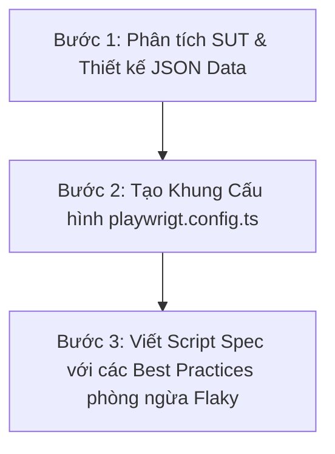

# Hướng dẫn Kỹ năng AI Agent: Tự động hóa Thiết kế và Viết Script Playwright (Agent Skill)

Tài liệu này định nghĩa một **Agent Skill** (Kỹ năng đặc tả hệ thống prompt và quy trình kiểm thử) giúp huấn luyện một AI Agent khác có khả năng tự thiết kế dữ liệu kiểm thử (Data-Driven JSON) và tự động sinh mã nguồn Playwright ổn định, hạn chế tối đa các lỗi phổ biến (flaky tests).

---

## 1. Quy trình 3 bước của Agent Skill



### Bước 1: Phân tích mã nguồn SUT và sinh dữ liệu (Data-Driven JSON)
* **Quy tắc:** AI Agent phải đọc mã nguồn thực tế của trang frontend (file JSX/TSX) và backend (`server.js` hoặc API endpoints) để xác định chính xác hành vi thực tế thay vì giả định hệ thống lý tưởng hóa.
* **Đặc tả Boundary Value Analysis (BVA):** Luôn yêu cầu AI sinh các giá trị biên trùng, biên dưới sát nút, và biên trên sát nút.

### Bước 2: Thiết lập cấu hình Playwright chống xung đột (Race Conditions)
* Khi chạy test thao tác trực tiếp với Database (như CRUD danh mục, Quên mật khẩu lấy OTP chung một email), AI Agent phải cấu hình chạy đơn luồng:
  ```typescript
  // playwright.config.ts
  import { defineConfig } from '@playwright/test';
  export default defineConfig({
    workers: 1, // Bắt buộc chạy tuần tự
  });
  ```

### Bước 3: Áp dụng các Best Practices phòng ngừa lỗi Playwright
Khi sinh code `.spec.ts`, AI Agent bắt buộc phải tuân thủ các nguyên tắc sau:
1. **Xử lý bất đồng bộ SPA (Single Page Application):** Luôn dùng `await page.waitForLoadState('networkidle')` sau các hành động chuyển trang hoặc click nút gửi API để đợi React render xong DOM.
2. **Khắc phục lỗi Strict Mode:** Nếu bảng dữ liệu hoặc DOM có khả năng xuất hiện nhiều phần tử trùng tên, locator phải được giới hạn bằng `.first()`.
   * *Sai:* `await page.locator('tr:has-text("Laptop")').click();`
   * *Đúng:* `await page.locator('tr:has-text("Laptop")').first().click();`
3. **Assert giá trị tiền tệ động:** Tránh dùng `toLocaleString()` mà không có locale. Nên sử dụng phương pháp `slice(0, 3)` để so sánh các chữ số đầu tiên của số tiền thanh toán nhằm triệt tiêu sự khác biệt về định dạng dấu chấm/phẩy giữa các môi trường hệ điều hành.

---

## 2. Prompt Mẫu để kích hoạt Skill này trên AI khác

Dán Prompt này vào AI của bạn khi muốn bắt đầu một task viết test Playwright mới:

> Bạn là một AI Test Engineer chuyên nghiệp. Hãy viết script test Playwright cho tính năng [TÊN_TÍNH_NĂNG] theo kỹ năng sau:
> 1. Thiết kế file JSON test data tách biệt với 12 test cases bao gồm Happy path, Biên BVA, và các case lỗi.
> 2. Đọc mã nguồn backend được cung cấp để xác định đúng giá trị mong đợi (expectedResult), không tự giả định backend hoạt động đúng chuẩn.
> 3. Trong file spec, xử lý triệt để bất đồng bộ bằng networkidle, tránh lỗi strict mode bằng cách dùng `.first()`, và so sánh tiền tệ an toàn bằng cách dùng `.slice(0, 3)` trên chuỗi thô.
